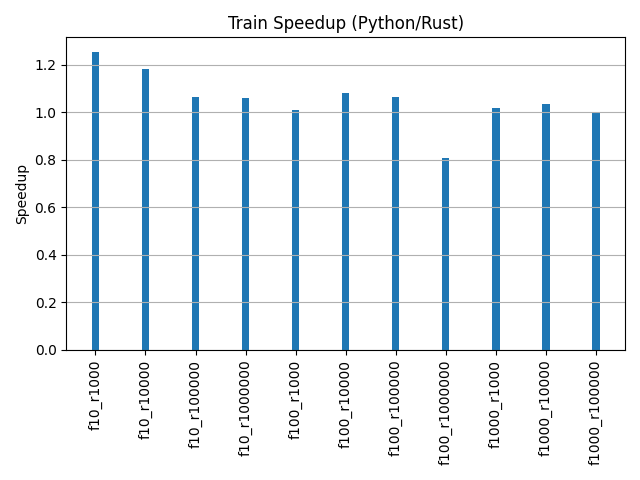
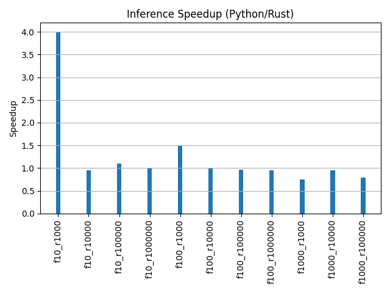

## Boosting with rust

## How to run
To generate data
```bash
python3 -m venv env
source env/bin/activate
pip install -r requirements.txt
```
Make sure that you have on your system `cmake`, `libomp` and `clang`. Example of execution is
```bash
python3 data_gen.py
python3 lightgbm_benchmark.py --train_input ./data/data_f10_s1000_train.csv --test_input ./data/data_f10_s1000_test.csv
cargo run -- --train_input ./data/data_f10_s1000_train.csv --test_input ./data/data_f10_s1000_test.csv 
cargo build --release
./target/release/lightgbm_rust --train_input ./data/data_f10_s1000_train.csv --test_input ./data/data_f10_s1000_test.csv 
```
The whole benchmark can be run as follows
```bash
cargo build --release
python3 data_gen.py
./benchmark.sh
python3 plot.py
```

## Results
Finally, the results.

Why is loading so slow in rust in comparison to python? Because in python I used polars which is **blazingly fast**. Using polars in rust made it even slower. The issue here is that the rust package `lightgbm` which has only function as a wrapper for C++ code of actual LightGBM, does support only specific input which is not really practical. 


We seee that training time is basically the same. No gains here.



The last implies that the only part where rust has noticeable advantable is when scoring small dataframes. This could be used in practice when you need to score the data extremely fast. I can imagine building the whole REST API for inference with only rust.



Benchmarked on
```
# lsb_release -a
LSB Version:	:core-4.1-amd64:core-4.1-noarch
Distributor ID:	OracleServer
Description:	Oracle Linux Server release 8.8
Release:	8.8
Codename:	n/a
# lscpu
Architecture:        x86_64
CPU op-mode(s):      32-bit, 64-bit
Byte Order:          Little Endian
CPU(s):              8
On-line CPU(s) list: 0-7
Thread(s) per core:  1
Core(s) per socket:  1
Socket(s):           8
NUMA node(s):        1
Vendor ID:           GenuineIntel
BIOS Vendor ID:      GenuineIntel
CPU family:          6
Model:               63
Model name:          Intel(R) Xeon(R) CPU E5-2699 v4 @ 2.20GHz
BIOS Model name:     Intel(R) Xeon(R) CPU E5-2699 v4 @ 2.20GHz
Stepping:            0
CPU MHz:             2197.454
BogoMIPS:            4394.90
Hypervisor vendor:   VMware
Virtualization type: full
L1d cache:           32K
L1i cache:           32K
L2 cache:            256K
L3 cache:            56320K
NUMA node0 CPU(s):   0-7
Flags:               fpu vme de pse tsc msr pae mce cx8 apic sep mtrr pge mca cmov pat pse36 clflush mmx fxsr sse sse2 ss syscall nx pdpe1gb rdtscp lm constant_tsc arch_perfmon nopl xtopology tsc_reliable nonstop_tsc cpuid tsc_known_freq pni pclmulqdq ssse3 fma cx16 pcid sse4_1 sse4_2 x2apic movbe popcnt tsc_deadline_timer aes xsave avx f16c rdrand hypervisor lahf_lm abm invpcid_single pti ssbd ibrs ibpb stibp fsgsbase tsc_adjust bmi1 avx2 smep bmi2 invpcid xsaveopt arat md_clear flush_l1d arch_capabilities
```